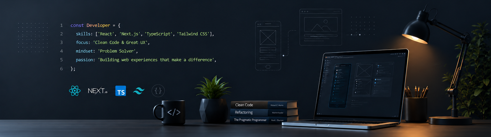

  

<h1 align="center">Hi, I'm Yasin 👋</h1>

  Frontend Developer • TypeScript Enthusiast • Problem Solver

  

---

## 🧠 About

Frontend developer with a software engineering mindset.

I enjoy solving complex problems, designing maintainable architectures, and creating user experiences that feel polished down to the smallest details.

My work focuses on scalability, type safety, performance, and pixel-perfect implementation. I believe great products are built when engineering quality and user experience are treated with equal importance.

---

## ⚡ Tech Stack

  

---

## 🎯 What I Care About

- Clean Architecture
- Type Safety
- Pixel-Perfect UI Implementation
- Attention to Detail
- Maintainable Codebases
- Performance Optimization
- Accessibility
- Great Developer Experience

---

## 📚 Currently Exploring

- Advanced Frontend Architecture
- Design Systems
- Authentication & Security
- Next.js Performance Patterns
- Scalable React Applications

---

## 📊 GitHub Analytics

  
  

  

---

## 🌐 Connect

  <a href="https://linkedin.com/in/yasinsanjari">LinkedIn</a> •
  <a href="mailto:yasinsanjari7@gmail.com">Email</a>

---

  <i>Good UX is important. Good code is important. Great products require both.</i>

